# US building permits

``` r
library(tidyverse)
```

    ## ── Attaching packages ──────────────────────────────────────── tidyverse 1.2.0.9000 ──

    ## ✔ ggplot2 2.2.1.9000     ✔ purrr   0.2.4     
    ## ✔ tibble  1.4.1          ✔ dplyr   0.7.4     
    ## ✔ tidyr   0.7.2.9000     ✔ stringr 1.2.0     
    ## ✔ readr   1.1.1          ✔ forcats 0.2.0

    ## ── Conflicts ──────────────────────────────────────────────── tidyverse_conflicts() ──
    ## ✖ dplyr::filter() masks stats::filter()
    ## ✖ dplyr::lag()    masks stats::lag()

## Data import

Data downloaded from
<https://www.recenter.tamu.edu/data/building-permits/>

``` r
permits_raw <- read_csv("dataPermit_full.csv", na = "null")
```

    ## Parsed with column specification:
    ## cols(
    ##   area = col_character(),
    ##   date = col_character(),
    ##   f1units = col_integer(),
    ##   f1change = col_double(),
    ##   f1value = col_integer(),
    ##   f1valchange = col_double(),
    ##   f24units = col_integer(),
    ##   f24change = col_double(),
    ##   f24value = col_integer(),
    ##   f24valchange = col_double(),
    ##   f5units = col_integer(),
    ##   f5change = col_double(),
    ##   f5value = col_integer(),
    ##   f5valchange = col_double()
    ## )

``` r
permits_raw
```

    ## # A tibble: 89,660 x 14
    ##    area  date  f1un… f1ch… f1va… f1va… f24u… f24c… f24v… f24v… f5un… f5ch…
    ##    <chr> <chr> <int> <dbl> <int> <dbl> <int> <dbl> <int> <dbl> <int> <dbl>
    ##  1 Abil… 01/1…    24    NA 67900    NA     4    NA 46200    NA   200    NA
    ##  2 Abil… 02/1…    39    NA 75900    NA     0    NA     0    NA     0    NA
    ##  3 Abil… 03/1…    38    NA 78000    NA     4    NA 37000    NA     0    NA
    ##  4 Abil… 04/1…    29    NA 66500    NA     0    NA     0    NA     0    NA
    ##  5 Abil… 05/1…    29    NA 77600    NA     0    NA     0    NA     0    NA
    ##  6 Abil… 06/1…    42    NA 66500    NA     0    NA     0    NA     0    NA
    ##  7 Abil… 07/1…    48    NA 67600    NA    18    NA 24400    NA     0    NA
    ##  8 Abil… 08/1…    67    NA 69000    NA     0    NA     0    NA     0    NA
    ##  9 Abil… 09/1…    53    NA 60800    NA     2    NA 31200    NA     0    NA
    ## 10 Abil… 10/1…    80    NA 73000    NA     2    NA 23800    NA   152    NA
    ## # ... with 89,650 more rows, and 2 more variables: f5value <int>,
    ## #   f5valchange <dbl>

  - f1 = 1 family home; f24 = 2-4 family home; f5 = 5+ unit home
  - units = number built; change = percent change from previous month
  - value = average value per unit; valchange = percent change from
    previous month Hire Director of Education

Eliminate the change and valchange variables; can easily recompute if
needed (and good practice to be sceptical about someone elses
computations)

``` r
permits <- permits_raw %>%
  select(-ends_with("change")) %>%
  separate(date, c("month", "year"), "/", convert = TRUE) %>%
  filter(year > 2007)
permits
```

    ## # A tibble: 44,707 x 9
    ##    area        f1units month  year f1value f24units f24value f5units f5va…
    ##    <chr>         <int> <int> <int>   <int>    <int>    <int>   <int> <int>
    ##  1 Abilene, TX      10     1  2008  179100        4   111500       0     0
    ##  2 Abilene, TX      19     2  2008  158000        2    80000       0     0
    ##  3 Abilene, TX      29     3  2008  190300        0        0       0     0
    ##  4 Abilene, TX      21     4  2008  155600        0        0       0     0
    ##  5 Abilene, TX      26     5  2008  159500        0        0       0     0
    ##  6 Abilene, TX      14     6  2008  142100        0        0       0     0
    ##  7 Abilene, TX      20     7  2008  192600        0        0       0     0
    ##  8 Abilene, TX      17     8  2008  215000        0        0       0     0
    ##  9 Abilene, TX       9     9  2008  127500        0        0       0     0
    ## 10 Abilene, TX       8    10  2008  174700        0        0       0     0
    ## # ... with 44,697 more rows

## Very basic EDA

``` r
permits %>% count(year)
```

    ## # A tibble: 10 x 2
    ##     year     n
    ##    <int> <int>
    ##  1  2008  4560
    ##  2  2009  4560
    ##  3  2010  4560
    ##  4  2011  4560
    ##  5  2012  4560
    ##  6  2013  4560
    ##  7  2014  4572
    ##  8  2015  4380
    ##  9  2016  4380
    ## 10  2017  4015

``` r
permits %>% count(area)
```

    ## # A tibble: 381 x 2
    ##    area                                  n
    ##    <chr>                             <int>
    ##  1 Abilene, TX                         119
    ##  2 Akron, OH                           119
    ##  3 Albany-Schenectady-Troy, NY         119
    ##  4 Albany, GA                          119
    ##  5 Albany, OR                          119
    ##  6 Albuquerque, NM                     119
    ##  7 Alexandria, LA                      119
    ##  8 Allentown-Bethlehem-Easton, PA-NJ   119
    ##  9 Altoona, PA                         119
    ## 10 Amarillo, TX                        119
    ## # ... with 371 more rows

``` r
permits %>% count(area) %>% count(n)
```

    ## # A tibble: 3 x 2
    ##       n    nn
    ##   <int> <int>
    ## 1    47     1
    ## 2    84    16
    ## 3   119   364

I’m going to arbitrarily focus on single family houses.

``` r
ggplot(permits, aes(year + month / 12, f1units)) + 
  geom_line(aes(group = area))
```

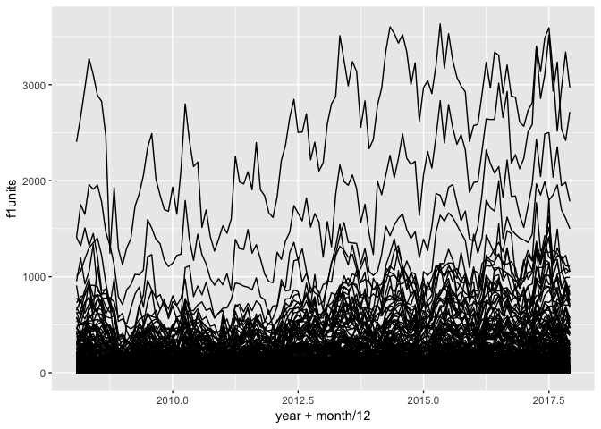<!-- -->

## Focus on big cities

TOO MUCH DATA.

Let’s start by focusing on the bigger cities. This might give a
misleading overview (maybe big cities are different fundamentally) but
it’s a good place to start because they’ll have more permits so should
hopefully be less variation and the long-term patterns clearler.

``` r
f1units <- permits %>% 
  group_by(area) %>%
  summarise(mean = mean(f1units)) %>% 
  arrange(desc(mean))
f1units
```

    ## # A tibble: 381 x 2
    ##    area                                            mean
    ##    <chr>                                          <dbl>
    ##  1 Houston-The Woodlands-Sugar Land, TX            2546
    ##  2 Dallas-Fort Worth-Arlington, TX                 1802
    ##  3 Atlanta-Sandy Springs-Roswell, GA               1154
    ##  4 Phoenix-Mesa-Scottsdale, AZ                     1057
    ##  5 Washington-Arlington-Alexandria, DC-VA-MD-WV     955
    ##  6 Austin-Round Rock, TX                            795
    ##  7 Charlotte-Concord-Gastonia, NC-SC                786
    ##  8 New York-Newark-Jersey City, NY-NJ-PA            758
    ##  9 Orlando-Kissimmee-Sanford, FL                    713
    ## 10 Nashville-Davidson--Murfreesboro--Franklin, TN   647
    ## # ... with 371 more rows

``` r
permits_big <- permits %>% 
  semi_join(f1units %>% filter(mean > 120)) %>%
  mutate(date = year + (month - 1) / 12)
```

    ## Joining, by = "area"

Now replot:

``` r
ggplot(permits_big, aes(date, f1units)) + 
  geom_line(aes(group = area))
```

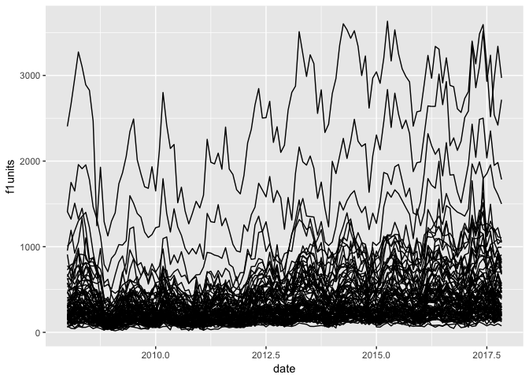<!-- -->

``` r
ggplot(permits_big, aes(date, f1units)) + 
  geom_line(aes(group = area)) + 
  scale_y_log10()
```

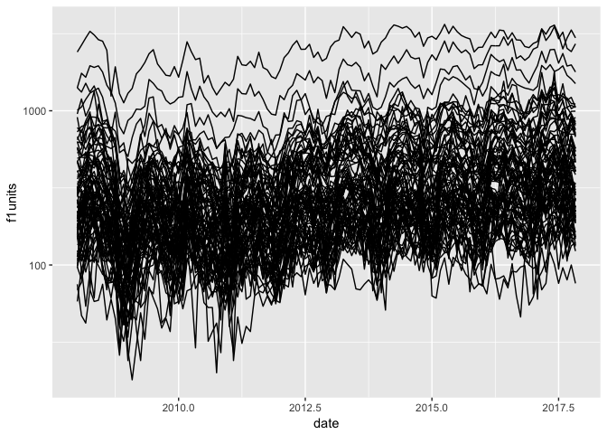<!-- -->

``` r
ggplot(permits_big, aes(date, f1units)) + 
  geom_line(aes(group = area), alpha = 1/10) + 
  scale_y_log10()
```

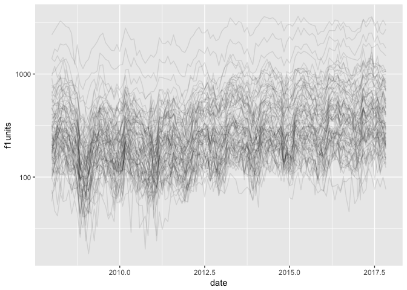<!-- -->

``` r
ggplot(permits_big, aes(date, f1units)) + 
  geom_line(aes(group = area), alpha = 1/5) + 
  scale_y_log10() + 
  geom_smooth(se = FALSE)
```

    ## `geom_smooth()` using method = 'gam' and formula 'y ~ s(x, bs = "cs")'

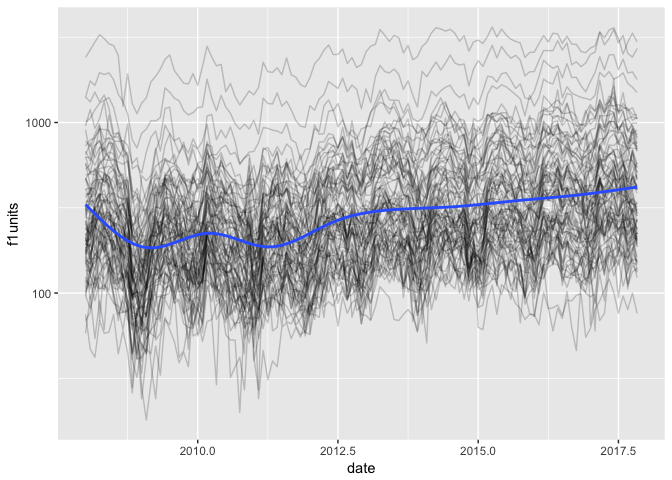<!-- -->

## What’s that regular pattern?

``` r
houston <- permits_big %>% filter(str_detect(area, "Houston"))
ggplot(houston, aes(date, f1units + 1)) +
  geom_line()
```

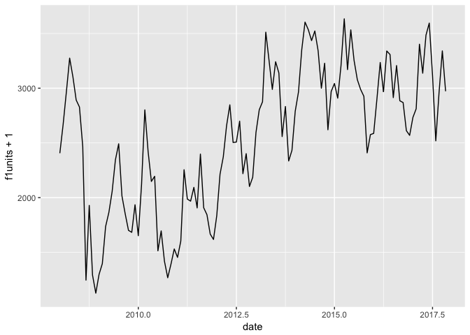<!-- -->

``` r
ggplot(houston, aes(month, f1units + 1)) +
  geom_line(aes(group = year)) +
  geom_smooth(se = FALSE)
```

    ## `geom_smooth()` using method = 'loess' and formula 'y ~ x'

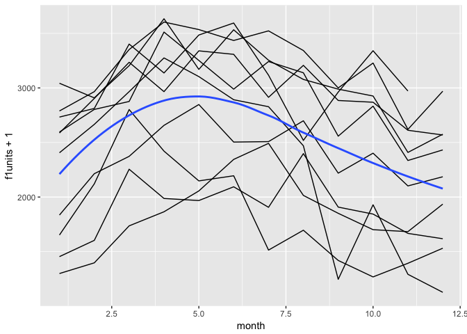<!-- -->

``` r
ggplot(houston, aes(month, f1units + 1)) +
  geom_line(aes(group = year)) +
  geom_smooth(se = FALSE) + 
  scale_y_log10()
```

    ## `geom_smooth()` using method = 'loess' and formula 'y ~ x'

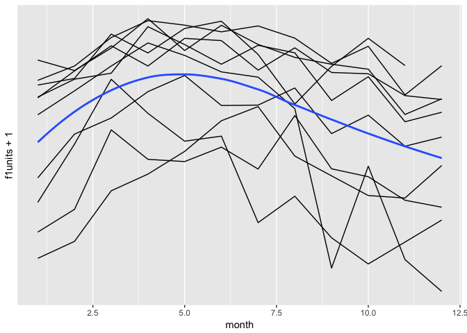<!-- -->

Wonderings:

  - Is the seaonal pattern more pronounced in colder climates?
  - What’s the lag between permitting and beginning construction?
  - What drives seasonal pattern? July usually less pleasant than Jan in
    Houston.

## Can we remove it?

Let’s use a model to partition the signal into monthly pattern + other

``` r
library(modelr)

houston_mod <- lm(log(f1units) ~ factor(month), data = houston)
houston %>%
  add_predictions(houston_mod) %>%
  ggplot(aes(date, pred)) +
  geom_line()
```

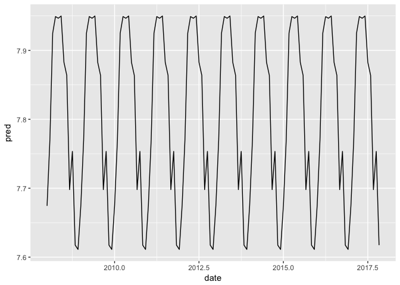<!-- -->

``` r
houston %>%
  add_residuals(houston_mod) %>%
  ggplot(aes(date, resid)) +
  geom_hline(yintercept = 0, colour = "white", size = 3) +
  geom_line()
```

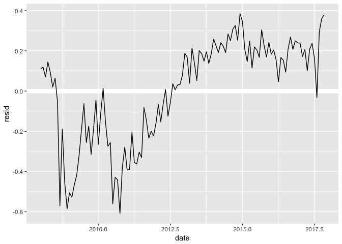<!-- -->

## Now for all cities

``` r
by_area <- permits_big %>%
  group_by(area) %>%
  nest()

area_model <- function(df) {
  lm(log10(f1units + 1) ~ factor(month), data = df)
}

detrended <- by_area %>% mutate(
  model = map(data, area_model),
  resids = map2(data, model, add_residuals)
) %>% unnest(resids)


ggplot(detrended, aes(date, resid)) +
  geom_line(aes(group = area), alpha = 1/10) +
  geom_smooth(se = FALSE)
```

    ## `geom_smooth()` using method = 'gam' and formula 'y ~ s(x, bs = "cs")'

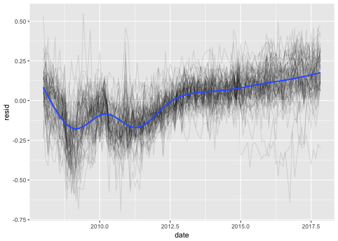<!-- -->

``` r
ggplot(detrended, aes(date, 10 ^ resid)) +
  geom_line(aes(group = area), alpha = 1/10) +
  geom_smooth(se = FALSE)
```

    ## `geom_smooth()` using method = 'gam' and formula 'y ~ s(x, bs = "cs")'

<!-- -->

``` r
ggplot(detrended, aes(date, 10 ^ resid)) +
  geom_line(aes(group = area), alpha = 1/10) +
  stat_summary(geom = "line", fun.y = function(x) quantile(x, 0.25), colour = "blue") +
  stat_summary(geom = "line", fun.y = function(x) quantile(x, 0.75), colour = "blue")
```

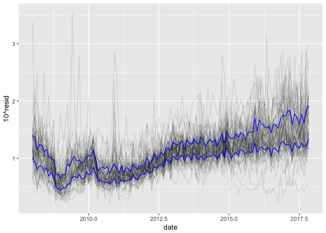<!-- -->

Wonderings:

  - Is the gap spreading?
  - Can explain why some cities are growing more?
  - Is it population? Is it geography? (Probably more complex than
    either\!)
  - Does the pattern follow for 2-4 and 5+ family units?
